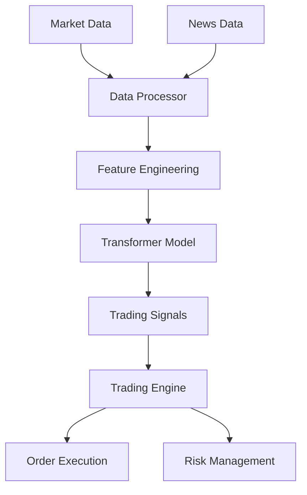

# Machine Learning-Based Predictive Trading Model

A sophisticated trading model that leverages machine learning to predict stock price movements using historical market data and news sentiment analysis.



## Project Overview

This project implements advanced machine learning techniques for financial forecasting, combining traditional statistical analysis with modern deep learning approaches. It features a high-performance C++ trading engine integrated with a Python-based Transformer model for market prediction.

### Key Components

1. **Data Processing (C++/Python)**
   ```mermaid
   graph LR
       A[Raw Data] --> B[Cleaning]
       B --> C[Feature Engineering]
       C --> D[Technical Indicators]
       D --> E[Normalized Data]
   ```
   - High-performance C++ data processor
   - Real-time technical indicator calculation
   - Efficient market data handling

2. **Transformer Model (Python)**
   ```mermaid
   graph LR
       A[Input Sequence] --> B[Positional Encoding]
       B --> C[Self-Attention]
       C --> D[Feed Forward]
       D --> E[Prediction]
   ```
   - Multi-head self-attention mechanism
   - Positional encoding for temporal data
   - Sequence-based prediction

3. **Trading Engine (C++)**
   ```mermaid
   graph TD
       A[ML Signal] --> B[Risk Check]
       B --> C{Position Limit}
       C -->|Within Limit| D[Order Creation]
       C -->|Exceeds Limit| E[Reject]
       D --> F[Order Queue]
       F --> G[Execution]
   ```
   - Thread-safe order processing
   - Risk management system
   - Position tracking
   - Multiple order types support

## Example Scenarios

### 1. Market Trend Prediction
```python
# Example prediction workflow
data = DataProcessor.load_market_data("AAPL")
features = data.prepare_features()
prediction = transformer_model.predict(features)

if prediction > THRESHOLD:
    trading_engine.submit_buy_order("AAPL", quantity=100)
else:
    trading_engine.submit_sell_order("AAPL", quantity=100)
```

### 2. Risk Management
```cpp
// C++ risk management example
void TradingEngine::process_ml_signal(const std::string& symbol, double signal) {
    // Create order based on ML signal
    Order order;
    order.symbol = symbol;
    order.type = OrderType::MARKET;
    order.side = signal > 0 ? OrderSide::BUY : OrderSide::SELL;
    order.quantity = std::abs(signal) * 100;
    
    // Check position limits
    if (check_risk_limits(order)) {
        submit_order(order);
    }
}
```

### 3. Technical Analysis
```python
# Computing technical indicators
processor = MarketDataProcessor(window_size=30)
processor.update(market_data)

sma = processor.get_sma(period=20)
rsi = processor.get_rsi(period=14)
bb_lower, bb_upper = processor.get_bollinger_bands()

# Trading decision based on indicators
if price < bb_lower and rsi < 30:
    trading_engine.process_ml_signal(symbol, 1.0)  # Strong buy signal
```

## Project Structure

```
ml_trading_model/
├── data/               # Market data storage
├── models/            # Trained model artifacts
├── notebooks/         # Analysis notebooks
├── src/
│   ├── cpp/          # High-performance components
│   │   ├── include/  # Header files
│   │   ├── src/     # Implementation files
│   │   └── test/    # C++ unit tests
│   └── python/      # ML model implementation
│       ├── data_processor.py
│       ├── transformer_model.py
│       └── test_transformer.py
└── tests/            # Integration tests
```

## Setup and Installation

1. **Python Dependencies**
   ```bash
   pip install -r requirements.txt
   ```

2. **C++ Dependencies**
   ```bash
   # On macOS
   brew install cmake pybind11
   ```

3. **Build C++ Components**
   ```bash
   cd src/cpp
   mkdir build && cd build
   cmake .. -DCMAKE_BUILD_TYPE=Release
   make
   ```

## Usage

1. **Data Preparation**
   ```python
   from data_processor import DataProcessor
   
   # Load and prepare data
   processor = DataProcessor()
   data = processor.load_data("AAPL")
   features = processor.prepare_features()
   ```

2. **Model Training**
   ```python
   from transformer_model import TransformerModel
   
   # Create and train model
   model = TransformerModel(
       n_features=37,
       d_model=64,
       nhead=8,
       num_layers=6
   )
   model.train(features, targets)
   ```

3. **Trading Execution**
   ```python
   from trading_cpp_bindings import TradingEngine
   
   # Initialize trading engine
   engine = TradingEngine()
   engine.start()
   
   # Process trading signals
   engine.set_position_limit("AAPL", 1000)
   engine.process_ml_signal("AAPL", model_prediction)
   ```

## Contributing

1. Fork the repository
2. Create your feature branch
3. Commit your changes
4. Push to the branch
5. Create a new Pull Request

## License

MIT License
